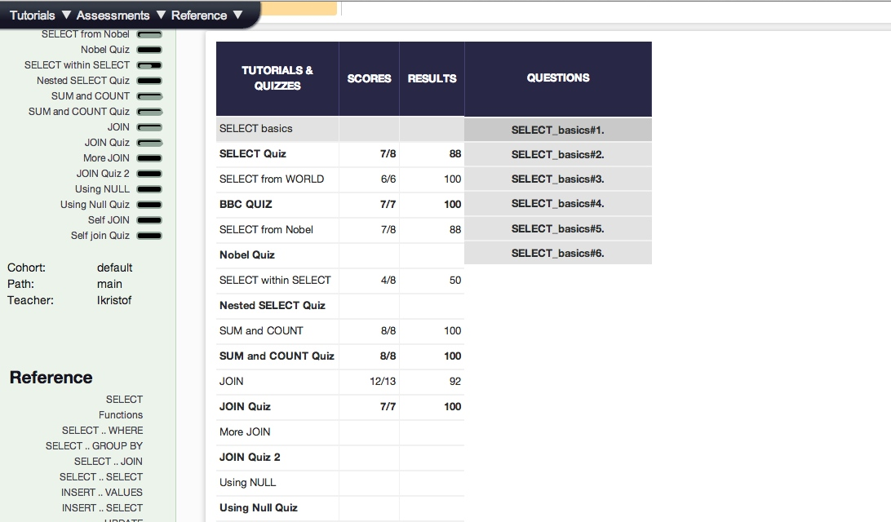

## U3.W7: SQLZoo

####I worked on this challenge by myself.

### My Quiz Results:
<!-- Include the link to your image (saved in the imgs folder) to display it inline. -->

### Reflection

I have used SQL before, but not in a long time, so this was a good refresher.  I think the sql zoo 
website itself was a little buggy, I had some isseus with account creation and I'm not entirely sure it recorded my quizzes accurately somehow (I did these over a few days, so I don't remember the scores exactly).  However, it gave me a good foundation and let me see what I remembered and what I needed to look up.  I wish it had been a little more tutorial-ish, but I think I have a pretty good grasp of basic SQL syntax.  The tutorial links in the repository are very helpful as well so I referenced them a couple times.