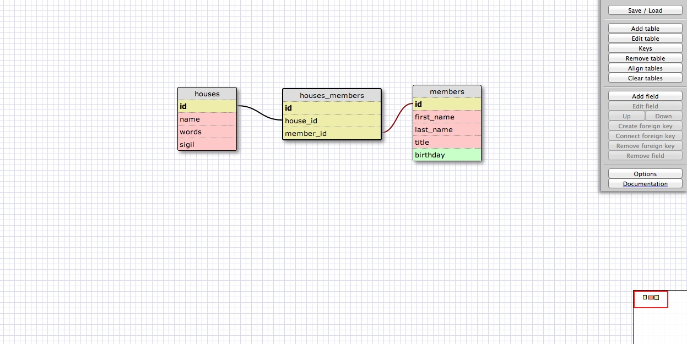

# U3.W7: Designing Schemas

#### I worked on this challenge [by myself, with: ]

## Release 0: Student Roster Schema
<!-- display your image inline here -->

## Release 1: One to Many Schema
<!-- display your image inline here -->

## Release 2: One to One Schema
<!-- display your image inline here -->

## Release 3: Many to Many Schema
<!-- display your image inline here -->

## Release 4: Design your own Schema
Description of what you're modeling: 

This first one is a one-to-one schema that is meant to model a social security number.  Each number is tied to a specific person, and each person only has one number.
<!-- display your one-to-one image inline here -->

This next one is a many-to-many schema that models the houses on Game of Thrones.  Nobles can belong to multiple houses (ex: Joffrey is of houses Baratheon and Lannister, theoretically) and each house (hopefully) has multiple members.  Yes, I'm a huge nerd.

<!-- display your many-to-many image inline here -->

## Release 5: Reflection

<!-- The only real trouble I had with this one was thinking of a good example of a one-to-one relationship.  The instructions said that it may be hard to think of a situation where a one-to-one relationship is necessary, since you could usually just combine the tables, and I found that to be true while trying to think of a relationship.  However, I have worked with big databases in the past and know that having fields that relate to one another in a sensible way is very, very important so I look forward to working more with databases in this way. -->
