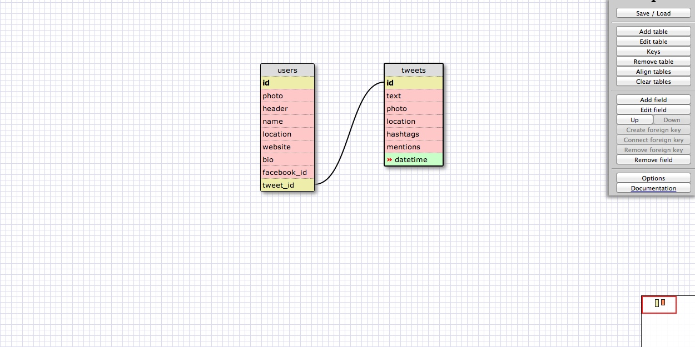

# U3.W7: Modeling a Real-World Database (SOLO CHALLENGE)

## Release 0: Users Fields
<!-- Identify the fields Twitter collects data for -->
1. Handle/screenname/ID (primary key)
2. Photo
3. Header
4. Name
5. Location
6. Website
7. Bio
8. Facebook (connect/post to Facebook)

## Release 1: Tweet Fields
<!-- Identify the fields Twitter uses to represent/display a tweet. What are you required or allowed to enter? -->

1. Text (required)
2. Photo (optional)
3. Location (optional)
4. Tags (optional)
5. Mentions (optional)
6. Time (required, automatic)

## Release 2: Explain the relationship
The relationship between `users` and `tweets` is: one-to-many
<!-- because... -->
Each tweet is originated by only one user, but each user can (and likely does) have multiple tweets.  If another person re-tweets something, it counts as a new tweet originated by the new user, I believe, so each tweet will be traced back to one particular user.

## Release 3: Schema Design
<!-- Include your image (inline) of your schema -->

## Release 4: SQL Statements
<!-- Include your SQL Statements. How can you make markdown files show blocks of code? -->

<!-- all the tweets for a certain user id -->

SELECT *
FROM users join tweets on tweet_id = id
WHERE users.id = 'Borcnation';

<!-- the tweets for a certain user id that were made after last Wednesday (whenever last Wednesday was for you) -->

SELECT *
FROM users join tweets on tweet_id = id
WHERE users.id = 'Borcnation' and datetime >= 5/15/14 12:00:00 AM; <!--  this means starting at midnight on Thursday -->

<!-- all the tweets associated with a given user's twitter handle -->

SELECT *
FROM users join tweets on tweet_id = id
WHERE users.id = 'Borcnation' or mentions in ('Borcnation');

<!-- the twitter handle associated with a given tweet id -->

SELECT users.id, tweets.id
FROM users join tweets on tweet_id = id
WHERE tweet_id = 1234;

<!-- note: is the join necessary here? Maybe not since there is already a field for tweet ID in the users table -->

## Release 5: Reflection
<!-- Be sure to add your reflection here!!! -->

I'm not entirely sure I did this exercise correctly in practice, but I think conceptually I understand how Twitter stores its data and how they relate.  I felt like just two tables wasn't quite enough; for example, I included mentions as a field in the tweets table, but there could be multiple mentions within a single tweet (or hashtags), so it seems like those should be their own tables which one have a one-to-many relationship with the tweets table.  I could just be overthinking it for the purposes of this exercise, though.  